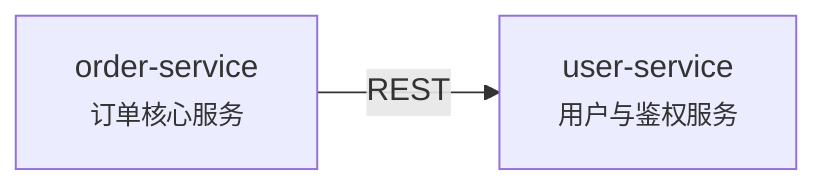

# 服务依赖图

> 由 `scripts/registry-graph.py` 从 `registry/services.yaml` 自动生成,勿手改。

```mermaid
graph LR
  order_service["order-service<br/><small>订单核心服务</small>"]
  user_service["user-service<br/><small>用户与鉴权服务</small>"]
  order_service -->|REST| user_service
```
