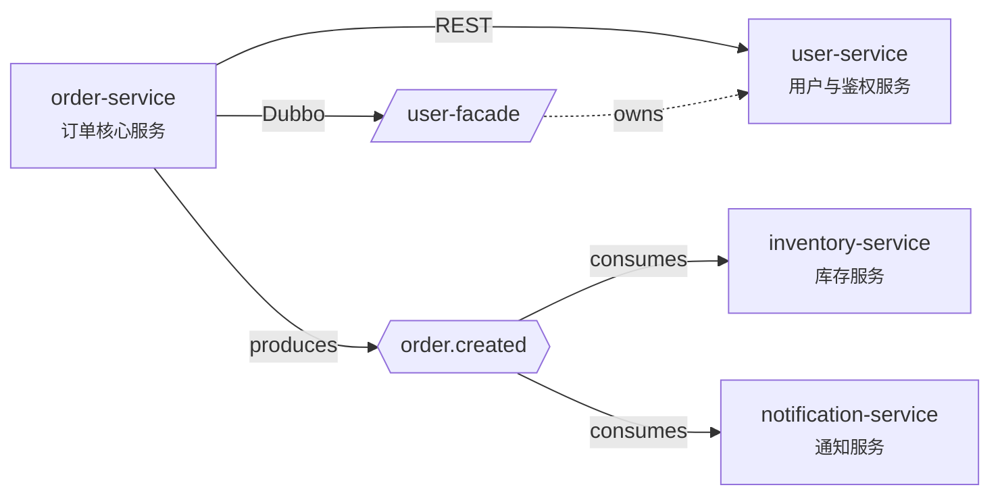

# 服务依赖图

> 由 `scripts/registry-graph.py` 从 `registry/services.yaml` 自动生成,勿手改。
> 矩形=服务,六边形=MQ topic,平行四边形=facade 接口。

```mermaid
graph LR
  s_order_service["order-service<br/><small>订单核心服务</small>"]
  s_user_service["user-service<br/><small>用户与鉴权服务</small>"]
  s_inventory_service["inventory-service<br/><small>库存服务</small>"]
  s_notification_service["notification-service<br/><small>通知服务</small>"]
  s_order_service -->|REST| s_user_service
  t_order_created{{"order.created"}}
  s_order_service -->|produces| t_order_created
  t_order_created -->|consumes| s_inventory_service
  t_order_created -->|consumes| s_notification_service
  f_user_facade[/"user-facade"/]
  f_user_facade -.owns.-> s_user_service
  s_order_service -->|Dubbo| f_user_facade
```
